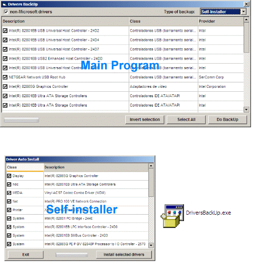



## Driver BackUp

### Description

Offers a solution for device drivers backup in Windows operating system. It identifies all the hardware in the system, extracts their associated drivers from the hard disk and backs them up to a location of your choice. Then when you format and reinstall/upgrade your operating system, you can restore all the "saved" drivers just as if you had the original driver diskettes in your hands.

Update: create Zip and self-install
 
### More Info
 

             |
---                |---
**Submitted On**   |2008-07-31 13:49:00
**By**             |[Adriano Paladini](https://github.com/Planet-Source-Code/PSCIndex/blob/master/ByAuthor/adriano-paladini.md)
**Level**          |Beginner
**User Rating**    |5.0 (30 globes from 6 users)
**Compatibility**  |VB 6\.0
**Category**       |[Complete Applications](https://github.com/Planet-Source-Code/PSCIndex/blob/master/ByCategory/complete-applications__1-27.md)
**World**          |[Visual Basic](https://github.com/Planet-Source-Code/PSCIndex/blob/master/ByWorld/visual-basic.md)
**Archive File**   |[Driver\_Bac2122317312008\.zip](https://github.com/Planet-Source-Code/adriano-paladini-driver-backup__1-70900/archive/master.zip)

